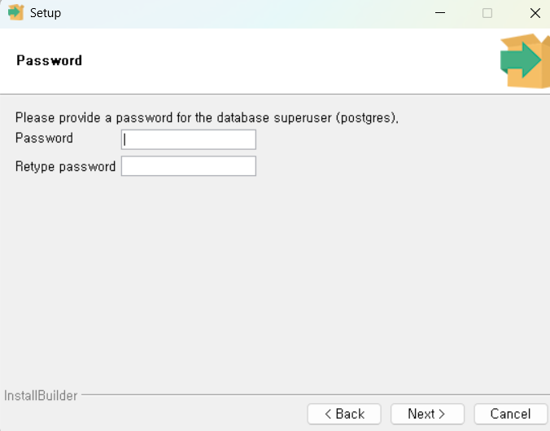
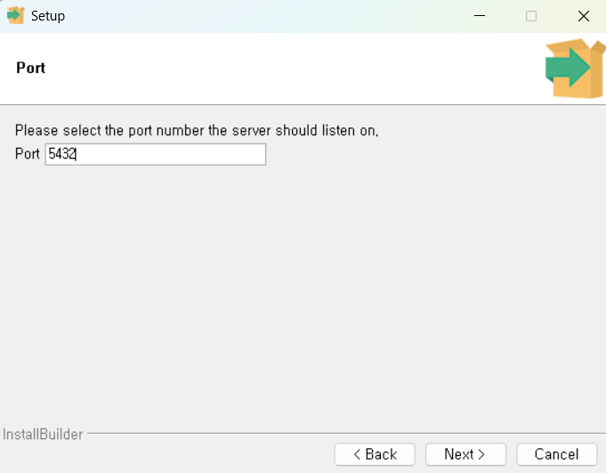
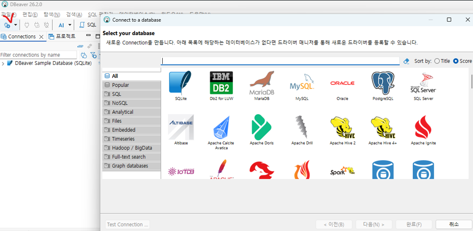
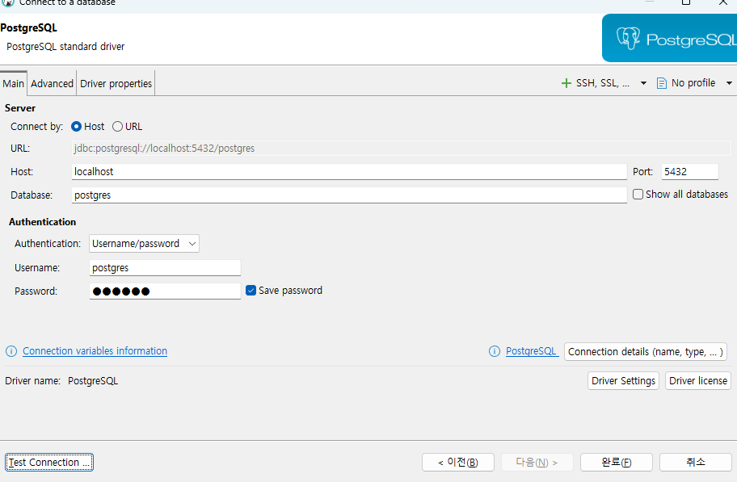
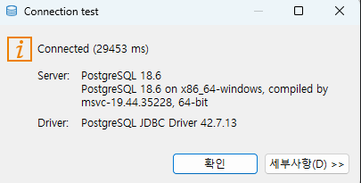
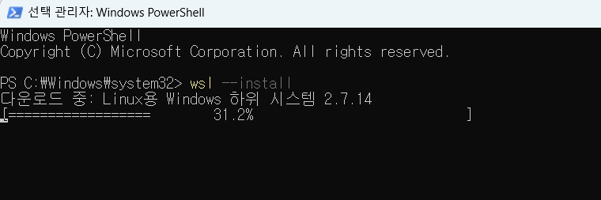
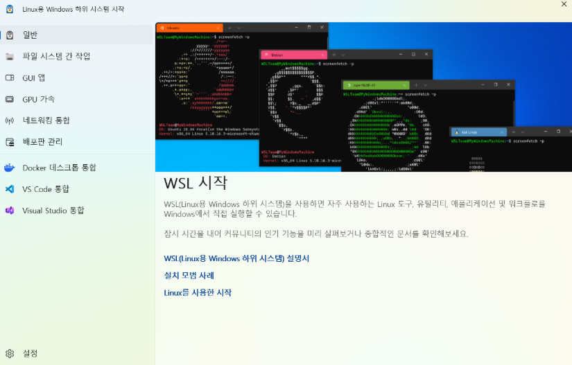
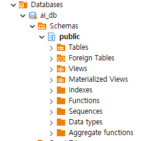
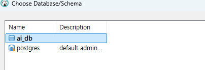
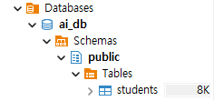

### ai-database-2026

AI에이전트 개발자 데이터베이스 리포지토

## 1일차

### PostgreSQL 개요

데이터베이스 . 데이터를 한군데에서 관리하는 목적의 시스템

줄여서 Postgre,Postgres 라고 통칭. **관계형** 데이터베이스.

`SQL`을 통해서 테이터를 저장, 수정, 삭제, 조회 할수있는 시스템

- 기타 관계형 데이터베이스
  - Oracle
  - MySQL / MariaDB
  - SQL Server

위 대부분 상용소프트웨어(비용을 지불하는) , Postgre는 오픈소스 System

### DB의 특징

- 데이터 무결성
- 데이터 안정성
- 데이터 동시성
- 표준 SQL 지원
- 확장성

### PostgreSQL 설치

#### 기본설치

- 자신의 OS에 직접 설치하는 방법
- postgresql-18.6-3-windows-x64.exe



- Superuser 아이디 - postgres 패스워드 지정



- port 5432 기억할것

### DBeaver 설치

GUI DB 관리 실행 툴

- https://dbeaver.io/download/
- 생략

### DB 접속

1. DBeaver 실행
2. 새 데이터베이스 연결 클릭 (PostgreQL 클릭)



3. 데이터베이스 설정 입력



4. Test Connection 클릭 Driver 다운로드 후



5. 정상 접속 확인 후 완료 클릭

#### Docker 개요

- 환경 의존성 문제를 해결한 컨테이너 기술 솔루션.
- 가상 환경상 프로그램을 실행하게 만듬
- 컨테이너 - OS , 라이브러리 , 설정 등 하나의 패키지로 만들어진 이미지
- 기본 Docker 실행파일 -> Docker Desktop 윈도우에서 Docker를 편하게 사용하도록

#### Docker Desktop 설치

- https://docs.docker.com/desktop/setup/install/windows-install/
- 윈도우 버전 다운로드 후 설치
- Close and Restart 이후
- WSL(Window Subsystem for Linux) 추가 설치





- 설치완료 후 화면

### PostgreSQL 이미지 다운로드

- 이미지 : 도커 리포지토리에 미리 만들어놓은 시스템 패키지
- 컨테이너 : 나의 도커에서 미리 다운로드 받은 이미지를 동작시킨 시스템

##### 도커 명령어 기본

```bash
docker --version
```

- 설치된 도커 확인

##### 도커에서 PostgreSQL 이미지 다운로드

```bash
docker pull postgres:latest
```

- Docker Desktop 전체 검색에서 pull(다운로드)

### 컨테이너 실행

#### 도커 명렁어로 실행

- 여러 옵션으로 실행을 해야하므로 거의 대부분 명령어로 실행

```bash
docker run --name my-postgres -e POSTGRES_PASSWORD=123456 -p 25432:5432 -d postgres:latest
```

### DBeaver에서 접속

## DB 기본사용법

#### Postgres 기본구조



- ai_db - 데이터베이스(프로젝트 전체공간)
- Schemas - 프로젝트 폴더
- Tables - 실제 데이터를 담는 표

#### DB 생성

- SQL 편집기 클릭
- 새이름으로 저장 , *.sql로 저장
- ai_db 명칭의 새 데이터베이스 생성

```sql
create database ai_db;
```

- Ctrl + Enter로 쿼리 실행
- DB 접속 정보에서 Show All database를 체크하고 재접속
- 데이터베이스 생성확인

#### 테이블 생성

- 데이터베이스 스키마를 사용할 데이터베이스로 반드시 선택



- 아래의 코드 작성

```sql
-- 테이블 생성
create table students (
	id int generated always as identity primary key, -- 학생 구분값 자동증가
	name varchar(50) not null, -- 이름
	age int, -- 나이
	email varchar(100), -- 이메일
	created_at timestamp default current_timestamp -- 현재 작성된 일자 
);
```

- Ctrl + Enter 실행



- 실행결과

#### 데이터 생성

- insert 쿼리 작성

```sql
-- 데이터 삽입(INSERT)
insert into public.students (name,age,email)
values ('홍길동',20,'honggd@example.com');

insert into public.students (name,age,email)
values ('김철수',21,'kimkim@gmail.com'),
		('김영희',27,'0hee@gmail.com'),
		('이동규',35,'dong92@gmail.com'),
		('임성준',35,'wood@gmail.com');

```

- select 쿼리 작성 - 난이도가 올라감

```sql
-- 데이터 확인(SELECT)
select * from public.students s ;
```

- update 쿼리 작성

```sql
-- 데이터 수정(UPDATE)
update students set 
		email = 'hoggd@kaka.com'
where id = 1;
```

- delete 쿼리 작성

```sql
-- 데이터 삭제(DELETE)
delete from students 
where name = '홍길동';
```

- CRUD - Create , Read ,Update ,Delete 의 약자
  - C - INSERT
  - R - SELECT
  - U - UPDATE
  - D - DELTE

#### Postgres 기본타입


| 데이터 타입 | 설명               | 예제                    |
| ----------- | ------------------ | ----------------------- |
| INT         | 정수               | 10,25,-9                |
| BIGINT      | 큰정수             | 100000000000            |
| NUMERIC     | 정확한 소수        | 120000.56               |
| VARCHAR(n)  | 길이 제한 문자열   | '홍길동'                |
| TEXT        | 긴 문자열(대략 2G) | 뉴스 게시물 논문        |
| BOOLEAN     | 참 또는 거짓       | ture , false            |
| DATE        | 날짜               | 2026-09-15              |
| TIMESTAMP   | 일자(날짜와 시간)  | 2026-09-15 16:00:20.456 |
| JSONB       | JSON 데이터        | {"name" : "홍길동}      |
