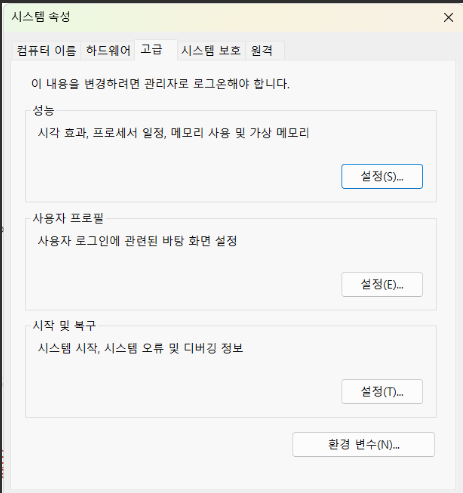
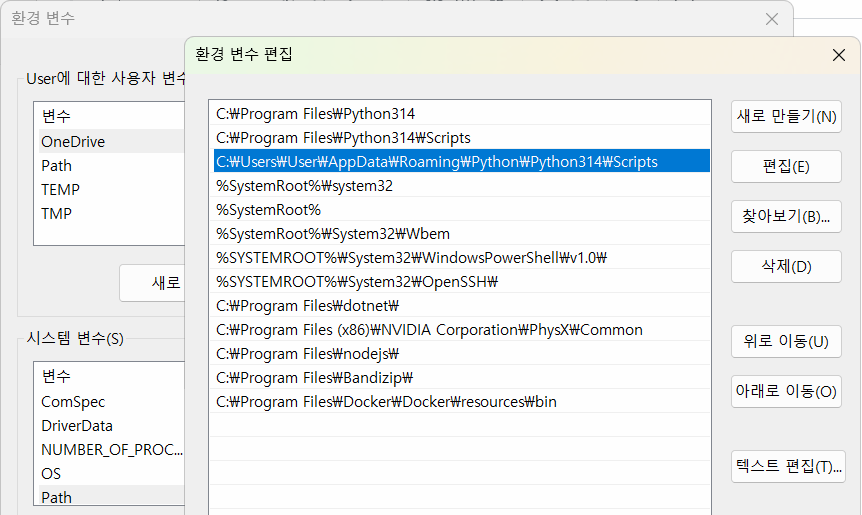
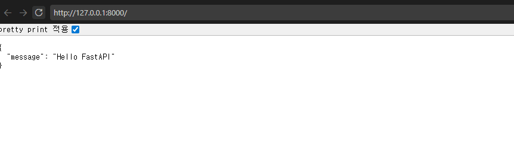
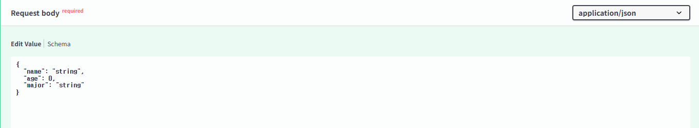
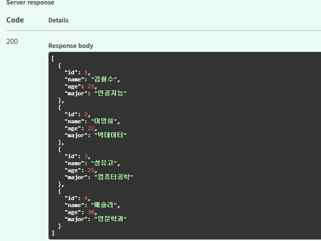
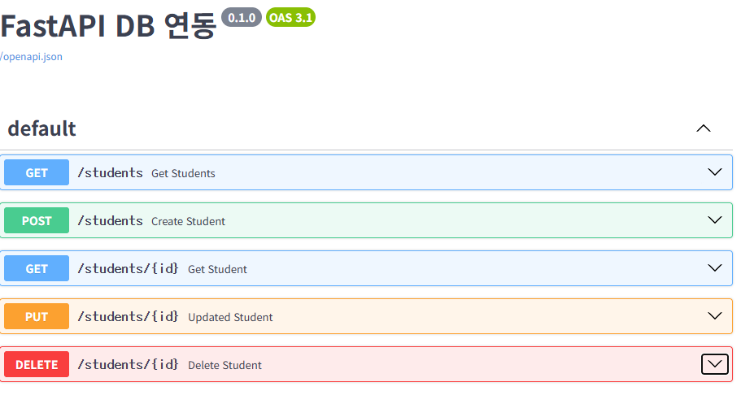

### FastAPI

## 개요

- FastAPI - Python으로 API 서버를 만드는 웹 프레임워크
- API - Application Programming Interface
- 사용자(클라이언트)가 웹, 모바일, 앱에서 요청을 하면 FastAPI 서버가 요청을 처리, 결과를 돌려줌
- JSON(파이썬 딕셔너리와 유사)으로 결과 리턴
- 예

```plaintext
사용자(클라이언트)
-> GET / students 요청
-> FastAPI 서버에서 DB를 조회
-> 학생목록 결과 JSON 응답
```

- 클라이언트(요청 Request) -> 서버(응답 Response)

### FastAPI 특징

- Python 문법으로 API를 만들 수 있음
- 코드가 간결하다
- 실행 속도가 빠르다
- 테스트를 위한 UI를 자동으로 만들어 줌
- Pydantic을 사용, 요청과 응답 데이터를 검증할 수 있다
- PostgresSQL, MYSQL, Oracle등 DB와 연동이 쉽다.

### API 서버

클라이언트 요청을 받아 필요한 작업을 수행, 그 결과를 클라이언트에게 돌려주는 프로그램

## 개발환경 설정

### FastAPI 패키지 설치

```bash
pip install fastapi uvicorn
```

- 현재 파이썬에서 fastapi와 uvicorn 패키지를 설치
- fastapi 개발 가능

```bash
pip list
```

- 패키지 설치 확인

### 기초 FastAPI 서버

- 소스 작성
- VS Code 재시작

### 문제해결

- 설치한 uvicorn.exe 위치가 Python 설치 위치와 상이
- C:\Users\User\AppData\Roaming\Python\Python314\Scripts 경로가 시스템 경로에 등록 되어야 함
- 시스템 속성(sysdm.cpl) 실행



- 환경변수 클릭



- 시스템 변수내 Path 상세에서 파이썬 경로 추가
- 확인
- VS Code , 터미널 재시작

### FastAPI 서버 시작

```bash
uvicorn main:app --reload --port 8000
```

- `--reload` : 수정되면 곧바로 반영되어서 서버 재시작
- `--port 8000` : 서버를 시작할 포트 지정
- http://127.0.0.1:8000 메세지
  - 127.0.0.1 -> localhost



### FastAPI 기본 학습

#### 웹 응답코드

- 200 : OK 웹페이지에 문제없음
- 404 : Page Not Fount 클라이언트가 요청한 페이지나 데이터가 없음
- 500 : Internal Server Error 내부 서버 오류

#### Swagger UI 확인

- FastAPI에서 자동으로 제공하는 API 테스트 페이지
- http(s)://address:port/docs
  


- api의 결과는 json 타입(문자열 일반적으로 "로 표현), 파이썬 딕셔너리 '로 표현하는 것과 차이점

#### URL 경로

- URL 기본 `http(s)://address:port`
  - address - 127.0.0.1 또는 192.168.0.105 등 아이피주소 , www.naver.com , google.com 등의 도메인주소
  - port - 0 ~ 65535 까지의 숫자
- `/` -root 기본되는 페이지
- `/students` - 추가 URL. Restful URL
- `/students/1` -추가 URL .경로파라미터
- `/?key=value&key=value` - URL 경로 Get쿼리 파라미터

#### HTTP(s) 메서드

FastAPI는 주소와 HTTP 메서드도 파악필요


| 메서드   | 의미             | 예시                         |
| -------- | ---------------- | ---------------------------- |
| `GET`*   | 데이터 조회      | 학생목록 조회, 특정학생 조회 |
| `POST`*  | 데이터 생성      | 학생 등록 / 예전 수정과 삭제 |
| `PATCH`  | 데이터 일부 수정 | 학생 전공 수정               |
| `PUT`    | 데이터 전체 수정 | 학생 정보 전체 수정          |
| `DELETE` | 데이터 삭제      | 학생 정보 삭제               |

- GET 메서드 외에는 swagger ui에서 테스트 해야함. POST , PUT , PATCH , DELETE


#### 요청 본문

- POST나 PATCH 요청시는 클라이언트가 JSON으로 데이터를 서버에 전달해야 함. 그 데이터를 등록 또는 수정.
- FastAPI에서는 Pydantic 패키지 모델을 사용
- JSON 데이터이므로 파이썬 None 대신 null로 사용
- } 닫기전 ,는 제거(파이썬은 허용)

#### 메모리 기반(DB X) 학생 API 예제

- day05/memorydb.py
- GET method 함수 내용 생략

##### POST 학생 정보 생성

- POST 메서드 작성
- Swagger 테스트
  - Try it out 클릭
  - Request body



- 실행 화면



##### HTTPException

- API 상에 오류가 발생하면 오류(예외) 처리를 진행


| 상태코드   | 의미                    |
| ---------- | ----------------------- |
| `200`,201  | 요청 성공 , 생성 성공   |
| 403 ,`404` | 권한 없음 , 데이터 없음 |
| `500`      | 서버 오류               |

### DB연동 FastAPI

- 실제 DB(PostgreSQL) 연동, 데이터를 가져와 사용하는 API 웹서버 구현
- 일반적인 API 서버 구조

```plaintext
fastapi_postgres(day06)/
│
├── main.py          # FastAPI 실행 및 API
├── database.py      # PostgreSQL 연결
├── models.py        # 데이터 모델
│
└── requirements.txt # 필요한 패키지
```

- 더 간단한 구조

```plaintext
fastapi_postgres(day06)/
│
├── main.py          # FastAPI 웹 서버
└── database.py      # PostgreSQL 연결
```

#### DB 연동 파이썬 패키지 설치

- psycopg

```bash
pip install psycopg[binary]
```

- 내 개발 환경(파이썬 패키지) 공유. requirments.txt 파일만 전달

```bash
pip freeze > requirments.txt
```

- 개발환경 재설치

```bash
pip install -r requirments.txt
```

#### 기존 PostgreSQL students 테이블 사용

- 내용 생략

#### database.py

- PostgreSQL 데이터베이스 연결용 소스코드
- 소스

#### main.py

- database.py 를 호출해서 실제 DB 연결과 FastAPI 작업 병행



### 디버깅

- Debug - 버그를 고치는 작업
- 소스코드 작성에 60%, 디버그 40% 시간 소요
- 디버그 단축키
  - F5 : 디버그로 실행
  - F9 : 브레이크포인트 토클
  - F10 : 한단계씩 실행(함수 패스)
  - F11 : 한단계씩 실행(함수내 진입)

#### FastAPI 디버깅

- 기존 FastAPI 코드 외 아래의 디버그 코드 추가

```python
import uvicorn

# 기존코드 생략

if __name__ == '__main__':
    uvicorn.run(
       'main:app',
       host='127.0.0.1',
       port=8000,
       reload=True,
       log_level='debug'
)

```

- `F5`(디버그 모드)로 실행
- 디버깅 필요한 함수나 로직에 `F9`로 종단점(Break Point) 활성화
- 로직 실행하면 종단점에 일시중단
- `F10` 또는 `F11`로 한 줄씩 실행하면서 로직 처리 결과 모니터링, 조사식과 변수에서 데이터 분석
- 오류 로직 찾아서 수정
- 다시 디버깅으로 정상동작 확인후 완료
